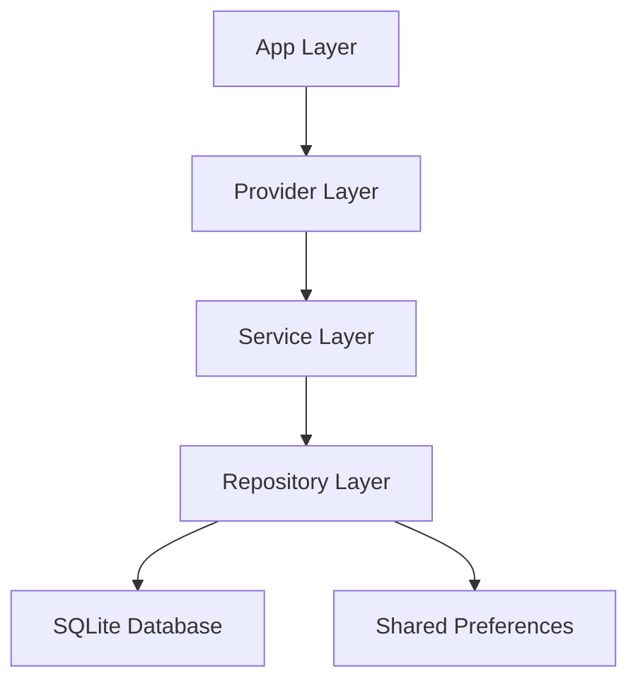

# Flutter Budget Management App - Improvement Plan

## Executive Summary

This document outlines a comprehensive improvement plan for the **gestion_budgetaire** Flutter application. The current app has a solid foundation with authentication, transaction management, budget goals, and reporting features. However, it currently uses in-memory data storage and lacks several key features that would enhance user experience and data reliability.

## Current Application Analysis

### Strengths
- Well-structured architecture with clear separation of concerns (Models, Services, Providers, Views)
- Modern UI with animations and smooth transitions
- Provider pattern for state management
- Comprehensive category system for income and expenses
- Budget goal tracking with visual indicators
- Basic reporting and analytics

### Current Limitations
- **No Data Persistence**: All data is stored in memory and lost on app restart
- **Mock Authentication**: No real user authentication or backend integration
- **Limited Analytics**: Basic reporting without advanced insights
- **No Data Export**: Users cannot export or backup their financial data
- **No Recurring Transactions**: Manual entry required for regular expenses/income
- **Single Currency**: Limited multi-currency support
- **No Notifications**: No reminders for bills or budget alerts
- **Basic Search**: Limited filtering and search capabilities

## Proposed Improvements

### 1. Data Persistence Layer (SQLite Integration)

**Priority**: HIGH  
**Impact**: Critical for production use

#### Implementation Strategy



#### Database Schema Design

**Users Table**
- id (TEXT PRIMARY KEY)
- full_name (TEXT)
- email (TEXT UNIQUE)
- currency (TEXT)
- avatar_url (TEXT)
- created_at (TEXT)
- updated_at (TEXT)

**Transactions Table**
- id (TEXT PRIMARY KEY)
- user_id (TEXT FOREIGN KEY)
- title (TEXT)
- amount (REAL)
- date (TEXT)
- category_id (TEXT)
- type (TEXT)
- description (TEXT)
- is_recurring (INTEGER)
- recurring_pattern (TEXT)
- created_at (TEXT)

**Budget Goals Table**
- id (TEXT PRIMARY KEY)
- user_id (TEXT FOREIGN KEY)
- name (TEXT)
- category_id (TEXT)
- target_amount (REAL)
- current_amount (REAL)
- month (TEXT)
- is_active (INTEGER)
- created_at (TEXT)

**Categories Table**
- id (TEXT PRIMARY KEY)
- user_id (TEXT)
- name (TEXT)
- icon_code_point (INTEGER)
- color_value (INTEGER)
- type (TEXT)
- budget (REAL)
- is_custom (INTEGER)

#### New Components to Create

1. **Database Helper** (`lib/database/database_helper.dart`)
   - Initialize SQLite database
   - Handle migrations
   - Provide database instance

2. **Repository Layer** (`lib/repositories/`)
   - `user_repository.dart` - User CRUD operations
   - `transaction_repository.dart` - Transaction CRUD operations
   - `budget_repository.dart` - Budget goal CRUD operations
   - `category_repository.dart` - Category CRUD operations

3. **Migration System** (`lib/database/migrations/`)
   - Version-based migration files
   - Automatic schema updates

#### Benefits
- Data persists across app sessions
- Faster data retrieval with indexed queries
- Support for complex queries and aggregations
- Foundation for offline-first architecture

---

### 2. Advanced Analytics and Insights

**Priority**: MEDIUM  
**Impact**: High user value

#### Features to Implement

**Spending Trends Analysis**
- Month-over-month comparison
- Year-over-year comparison
- Spending velocity (rate of spending)
- Projected end-of-month balance

**Category Insights**
- Top spending categories
- Category spending trends
- Unusual spending detection
- Category budget adherence score

**Income Analysis**
- Income stability score
- Income sources breakdown
- Income vs. expense ratio
- Savings rate calculation

**Predictive Analytics**
- Forecast future expenses based on historical data
- Predict budget overruns
- Suggest optimal budget allocations
- Cash flow predictions

#### New Components

1. **Analytics Service** (`lib/services/analytics_service.dart`)
   - Statistical calculations
   - Trend analysis algorithms
   - Prediction models

2. **Insights Provider** (`lib/providers/insights_provider.dart`)
   - Manage analytics state
   - Cache computed insights
   - Trigger recalculations

3. **Insights Page** (`lib/views/insights/insights_page.dart`)
   - Visual representation of insights
   - Interactive charts
   - Actionable recommendations

#### Data Visualizations
- Line charts for spending trends
- Pie charts for category distribution
- Bar charts for income vs. expenses
- Heat maps for spending patterns
- Progress indicators for goals

---

### 3. Data Export and Backup

**Priority**: HIGH  
**Impact**: Essential for user trust

#### Export Formats

**CSV Export**
- Transactions export
- Budget goals export
- Category-wise summaries
- Date range filtering

**PDF Reports**
- Monthly financial statements
- Annual summaries
- Category-wise reports
- Custom date range reports

**JSON Backup**
- Complete data backup
- Encrypted backup option
- Cloud storage integration (Google Drive, Dropbox)
- Automatic scheduled backups

#### Import Functionality
- Import from CSV
- Restore from JSON backup
- Data validation and conflict resolution
- Merge or replace options

#### New Components

1. **Export Service** (`lib/services/export_service.dart`)
   - CSV generation
   - PDF generation using `pdf` package
   - JSON serialization

2. **Backup Service** (`lib/services/backup_service.dart`)
   - Automatic backup scheduling
   - Cloud storage integration
   - Encryption/decryption

3. **Import Service** (`lib/services/import_service.dart`)
   - Parse CSV files
   - Validate imported data
   - Handle duplicates

4. **Export Settings Page** (`lib/views/settings/export_settings_page.dart`)
   - Configure export preferences
   - Schedule automatic backups
   - Manage cloud storage connections

---

### 4. Recurring Transactions

**Priority**: HIGH  
**Impact**: Significant time-saving for users

#### Features

**Recurring Patterns**
- Daily
- Weekly (specific days)
- Bi-weekly
- Monthly (specific date)
- Quarterly
- Annually
- Custom intervals

**Smart Features**
- Auto-create transactions on schedule
- Notification before creation
- Skip or modify individual occurrences
- End date or occurrence count
- Template management

**Recurring Transaction Management**
- View all recurring transactions
- Edit recurring patterns
- Pause/resume recurring transactions
- Delete with options (future only, all)

#### Database Schema Addition

**Recurring Transactions Table**
- id (TEXT PRIMARY KEY)
- user_id (TEXT FOREIGN KEY)
- title (TEXT)
- amount (REAL)
- category_id (TEXT)
- type (TEXT)
- description (TEXT)
- pattern (TEXT) - JSON: {frequency, interval, dayOfWeek, dayOfMonth}
- start_date (TEXT)
- end_date (TEXT)
- next_occurrence (TEXT)
- is_active (INTEGER)
- created_at (TEXT)

#### New Components

1. **Recurring Transaction Model** (`lib/models/recurring_transaction_model.dart`)
   - Pattern definition
   - Next occurrence calculation
   - Validation logic

2. **Recurring Transaction Service** (`lib/services/recurring_transaction_service.dart`)
   - Schedule management
   - Auto-creation logic
   - Pattern calculations

3. **Recurring Transaction Provider** (`lib/providers/recurring_transaction_provider.dart`)
   - State management
   - Background task coordination

4. **Recurring Transactions Page** (`lib/views/recurring/recurring_transactions_page.dart`)
   - List all recurring transactions
   - Add/edit recurring transactions
   - Visual calendar view

5. **Background Task Handler** (`lib/services/background_task_service.dart`)
   - Check for due recurring transactions
   - Create transactions automatically
   - Send notifications

---

### 5. Enhanced Multi-Currency Support

**Priority**: MEDIUM  
**Impact**: International user base

#### Features

**Multiple Currency Accounts**
- Support multiple currencies simultaneously
- Per-transaction currency selection
- Currency conversion tracking

**Exchange Rate Management**
- Automatic exchange rate updates (API integration)
- Manual exchange rate entry
- Historical exchange rate tracking
- Base currency for reporting

**Currency Conversion**
- Real-time conversion display
- Conversion history
- Multi-currency reports
- Exchange rate alerts

#### API Integration
- Use free APIs like:
  - ExchangeRate-API
  - Fixer.io
  - Open Exchange Rates

#### New Components

1. **Currency Model** (`lib/models/currency_model.dart`)
   - Currency code, symbol, name
   - Exchange rate to base currency

2. **Currency Service** (`lib/services/currency_service.dart`)
   - Fetch exchange rates
   - Cache rates locally
   - Convert between currencies

3. **Currency Provider** (`lib/providers/currency_provider.dart`)
   - Manage available currencies
   - Handle conversions
   - Update rates

4. **Currency Settings Page** (`lib/views/settings/currency_settings_page.dart`)
   - Select base currency
   - Manage exchange rates
   - Configure auto-update

#### Database Schema Addition

**Currencies Table**
- code (TEXT PRIMARY KEY)
- name (TEXT)
- symbol (TEXT)
- exchange_rate (REAL)
- last_updated (TEXT)

**Transaction Update**
- Add `currency_code` field
- Add `exchange_rate_at_time` field

---

### 6. Notification and Reminder System

**Priority**: MEDIUM  
**Impact**: Improved user engagement

#### Notification Types

**Budget Alerts**
- Approaching budget limit (70%, 90%, 100%)
- Budget exceeded
- Monthly budget summary

**Bill Reminders**
- Upcoming recurring transactions
- Overdue bills
- Payment confirmations

**Goal Notifications**
- Goal milestone reached
- Goal completion
- Goal at risk

**Insights Notifications**
- Unusual spending detected
- Savings opportunity identified
- Monthly financial summary

#### Implementation

**Local Notifications**
- Use `flutter_local_notifications` package
- Schedule notifications
- Handle notification taps

**Push Notifications** (Future)
- Firebase Cloud Messaging integration
- Server-side notification triggers

#### New Components

1. **Notification Service** (`lib/services/notification_service.dart`)
   - Initialize notification system
   - Schedule notifications
   - Handle notification actions

2. **Notification Settings** (`lib/views/settings/notification_settings_page.dart`)
   - Enable/disable notification types
   - Set notification times
   - Configure alert thresholds

3. **Notification Manager** (`lib/services/notification_manager.dart`)
   - Centralized notification logic
   - Notification queue management
   - Priority handling

---

### 7. Enhanced Data Visualization

**Priority**: MEDIUM  
**Impact**: Better user insights

#### New Chart Types

**Spending Heatmap**
- Calendar view with spending intensity
- Identify spending patterns by day/week

**Sankey Diagram**
- Income flow to expense categories
- Visual budget allocation

**Comparison Charts**
- Side-by-side month comparisons
- Budget vs. actual spending
- Income vs. expense trends

**Goal Progress Dashboard**
- Visual goal tracking
- Multiple goals at a glance
- Time-based progress

#### Interactive Features
- Drill-down capabilities
- Date range selection
- Category filtering
- Touch interactions for details

#### New Components

1. **Advanced Charts Widget** (`lib/widgets/charts/`)
   - `heatmap_chart.dart`
   - `sankey_chart.dart`
   - `comparison_chart.dart`
   - `goal_dashboard_chart.dart`

2. **Chart Configuration** (`lib/models/chart_config.dart`)
   - Chart type definitions
   - Customization options
   - Data formatting

---

### 8. Advanced Search and Filtering

**Priority**: LOW  
**Impact**: Improved usability

#### Search Features

**Full-Text Search**
- Search transactions by title, description
- Search by amount range
- Search by date range
- Search by category

**Advanced Filters**
- Multiple filter combinations
- Saved filter presets
- Quick filter chips
- Filter by tags (new feature)

**Smart Search**
- Recent searches
- Search suggestions
- Natural language queries (e.g., "food last month")

#### Tagging System
- Add custom tags to transactions
- Tag-based filtering
- Tag analytics
- Tag management

#### New Components

1. **Search Service** (`lib/services/search_service.dart`)
   - Full-text search implementation
   - Filter logic
   - Search indexing

2. **Search Page** (`lib/views/search/search_page.dart`)
   - Search interface
   - Filter UI
   - Results display

3. **Tag Model** (`lib/models/tag_model.dart`)
   - Tag definition
   - Tag relationships

4. **Tag Manager** (`lib/services/tag_service.dart`)
   - Tag CRUD operations
   - Tag suggestions

---

### 9. Security and Data Protection

**Priority**: HIGH  
**Impact**: User trust and compliance

#### Security Features

**Data Encryption**
- Encrypt sensitive data at rest
- Use `flutter_secure_storage` for credentials
- Encrypt database backups

**Biometric Authentication**
- Fingerprint authentication
- Face ID support
- PIN/Pattern lock

**Privacy Controls**
- Hide amounts option
- Private mode
- Transaction privacy levels

**Data Anonymization**
- Export anonymized data
- Share reports without personal info

#### Compliance
- GDPR compliance features
- Data deletion requests
- Privacy policy integration
- Terms of service

#### New Components

1. **Security Service** (`lib/services/security_service.dart`)
   - Encryption/decryption
   - Biometric authentication
   - Secure storage management

2. **Privacy Settings** (`lib/views/settings/privacy_settings_page.dart`)
   - Configure security options
   - Manage data privacy
   - Export/delete data

3. **Encryption Helper** (`lib/utils/encryption_helper.dart`)
   - Encryption utilities
   - Key management

---

## Implementation Roadmap

### Phase 1: Foundation (Weeks 1-3)
1. Implement SQLite data persistence
2. Create repository layer
3. Migrate existing services to use repositories
4. Add data migration system
5. Implement basic backup/restore

### Phase 2: Core Features (Weeks 4-6)
1. Implement recurring transactions
2. Add notification system
3. Enhance multi-currency support
4. Implement data export (CSV, PDF)

### Phase 3: Analytics & Insights (Weeks 7-9)
1. Build advanced analytics service
2. Create insights page
3. Add new chart types
4. Implement predictive analytics

### Phase 4: User Experience (Weeks 10-12)
1. Implement advanced search and filtering
2. Add tagging system
3. Enhance data visualizations
4. Improve UI/UX based on feedback

### Phase 5: Security & Polish (Weeks 13-14)
1. Implement security features
2. Add biometric authentication
3. Ensure GDPR compliance
4. Final testing and bug fixes

---

## Technical Dependencies

### New Packages Required

```yaml
dependencies:
  # Database
  sqflite: ^2.4.2  # Already included
  path_provider: ^2.1.5  # Already included
  
  # Security
  flutter_secure_storage: ^9.0.0
  local_auth: ^2.1.8
  encrypt: ^5.0.3
  
  # Notifications
  flutter_local_notifications: ^17.0.0
  timezone: ^0.9.2
  
  # Export/Import
  pdf: ^3.10.8
  csv: ^6.0.0
  file_picker: ^8.0.0
  share_plus: ^7.2.2
  
  # Cloud Storage
  google_sign_in: ^6.2.1
  googleapis: ^13.1.0
  
  # Currency
  http: ^1.2.0  # For API calls
  
  # Background Tasks
  workmanager: ^0.5.2
  
  # Charts (enhanced)
  syncfusion_flutter_charts: ^25.1.35
  
  # Utilities
  intl: ^0.20.2  # Already included
  uuid: ^4.5.2  # Already included
```

---

## Database Migration Strategy

### Migration Files Structure

```
lib/database/migrations/
├── migration_v1.dart  # Initial schema
├── migration_v2.dart  # Add recurring transactions
├── migration_v3.dart  # Add tags
└── migration_manager.dart  # Handles migrations
```

### Migration Example

```dart
class MigrationV2 extends Migration {
  @override
  int get version => 2;
  
  @override
  Future<void> upgrade(Database db) async {
    await db.execute('''
      CREATE TABLE recurring_transactions (
        id TEXT PRIMARY KEY,
        user_id TEXT,
        title TEXT,
        amount REAL,
        category_id TEXT,
        type TEXT,
        pattern TEXT,
        start_date TEXT,
        end_date TEXT,
        next_occurrence TEXT,
        is_active INTEGER,
        created_at TEXT,
        FOREIGN KEY (user_id) REFERENCES users (id)
      )
    ''');
  }
  
  @override
  Future<void> downgrade(Database db) async {
    await db.execute('DROP TABLE IF EXISTS recurring_transactions');
  }
}
```

---

## Testing Strategy

### Unit Tests
- Test all repository methods
- Test service layer logic
- Test model serialization/deserialization
- Test analytics calculations

### Integration Tests
- Test database operations
- Test provider state management
- Test navigation flows
- Test data synchronization

### Widget Tests
- Test UI components
- Test user interactions
- Test form validations
- Test chart rendering

### End-to-End Tests
- Test complete user workflows
- Test data persistence
- Test backup/restore
- Test export/import

---

## Performance Considerations

### Database Optimization
- Create indexes on frequently queried columns
- Use transactions for batch operations
- Implement pagination for large datasets
- Cache frequently accessed data

### Memory Management
- Dispose controllers properly
- Use const constructors where possible
- Implement lazy loading for lists
- Optimize image loading

### Background Tasks
- Limit background task frequency
- Use efficient algorithms
- Batch operations when possible
- Monitor battery usage

---

## User Experience Enhancements

### Onboarding
- Welcome tutorial for new users
- Feature highlights
- Sample data for exploration
- Quick setup wizard

### Accessibility
- Screen reader support
- High contrast mode
- Font size adjustments
- Color blind friendly palettes

### Localization
- Multi-language support
- Date/time format localization
- Currency format localization
- RTL language support

### Offline Support
- Full offline functionality
- Sync when online
- Conflict resolution
- Offline indicators

---

## Success Metrics

### User Engagement
- Daily active users
- Session duration
- Feature adoption rates
- Retention rate

### Data Quality
- Transaction entry rate
- Budget goal completion rate
- Data export frequency
- Backup frequency

### Performance
- App launch time
- Database query performance
- UI responsiveness
- Crash rate

### User Satisfaction
- App store ratings
- User feedback
- Feature requests
- Bug reports

---

## Risk Assessment

### Technical Risks
- **Database migration failures**: Implement robust rollback mechanisms
- **Performance degradation**: Regular performance testing and optimization
- **Data loss**: Multiple backup strategies and data validation

### User Experience Risks
- **Feature complexity**: Gradual rollout with user education
- **Learning curve**: Comprehensive onboarding and help system
- **Migration friction**: Smooth transition with data preservation

### Security Risks
- **Data breaches**: Implement encryption and secure storage
- **Authentication bypass**: Multi-factor authentication option
- **Privacy concerns**: Clear privacy policy and user controls

---

## Conclusion

This improvement plan transforms the gestion_budgetaire app from a prototype with in-memory storage to a production-ready personal finance management application. The phased approach ensures steady progress while maintaining app stability. Priority is given to data persistence and core features that provide immediate user value, followed by advanced analytics and user experience enhancements.

The proposed improvements will:
- Ensure data reliability and persistence
- Provide valuable financial insights
- Save users time with automation
- Enhance security and privacy
- Improve overall user experience

Implementation should follow the roadmap while remaining flexible to user feedback and changing requirements.
