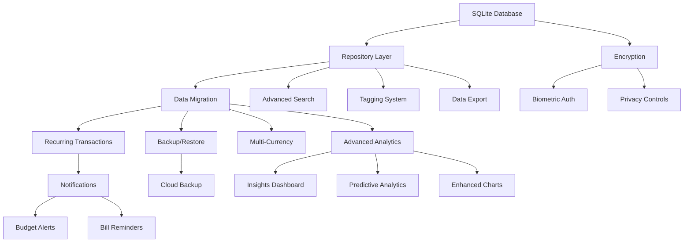

# Implementation Priority Matrix

## Overview

This document provides a prioritized breakdown of all proposed improvements for the gestion_budgetaire Flutter app, organized by impact, effort, and dependencies.

---

## Priority Matrix

### High Priority - High Impact - Must Have

| Feature | Impact | Effort | Dependencies | Timeline |
|---------|--------|--------|--------------|----------|
| **SQLite Data Persistence** | Critical | High | None | Week 1-3 |
| **Repository Layer** | Critical | Medium | SQLite | Week 2-3 |
| **Data Backup/Restore** | High | Medium | SQLite, Repository | Week 3-4 |
| **Recurring Transactions** | High | Medium | SQLite, Repository | Week 4-5 |
| **Security & Encryption** | High | Medium | SQLite | Week 13-14 |

### High Priority - Medium Impact - Should Have

| Feature | Impact | Effort | Dependencies | Timeline |
|---------|--------|--------|--------------|----------|
| **Local Notifications** | High | Low | None | Week 5-6 |
| **CSV Export** | Medium | Low | Repository | Week 6 |
| **PDF Reports** | Medium | Medium | Repository | Week 6-7 |
| **Biometric Auth** | Medium | Low | Security Service | Week 13 |
| **Budget Alerts** | High | Low | Notifications | Week 6 |

### Medium Priority - High Impact - Nice to Have

| Feature | Impact | Effort | Dependencies | Timeline |
|---------|--------|--------|--------------|----------|
| **Advanced Analytics** | High | High | Repository | Week 7-9 |
| **Spending Insights** | High | Medium | Analytics | Week 8-9 |
| **Predictive Analytics** | Medium | High | Analytics | Week 9 |
| **Enhanced Charts** | Medium | Medium | Analytics | Week 9-10 |
| **Multi-Currency Support** | Medium | Medium | Repository | Week 5-6 |

### Medium Priority - Medium Impact - Nice to Have

| Feature | Impact | Effort | Dependencies | Timeline |
|---------|--------|--------|--------------|----------|
| **Advanced Search** | Medium | Medium | Repository | Week 10-11 |
| **Tagging System** | Medium | Medium | Repository | Week 11 |
| **Cloud Backup** | Medium | High | Backup Service | Week 12 |
| **Data Import** | Low | Medium | Repository | Week 11 |
| **Spending Heatmap** | Medium | Medium | Analytics | Week 10 |

### Low Priority - Low Impact - Future Enhancements

| Feature | Impact | Effort | Dependencies | Timeline |
|---------|--------|--------|--------------|----------|
| **Sankey Diagrams** | Low | High | Analytics | Future |
| **Natural Language Search** | Low | High | Search Service | Future |
| **Social Sharing** | Low | Low | Export Service | Future |
| **Widgets** | Low | Medium | Repository | Future |
| **Dark Mode Enhancements** | Low | Low | Theme | Future |

---

## Detailed Priority Breakdown

### Phase 1: Foundation (Weeks 1-3) - CRITICAL

#### 1.1 SQLite Database Implementation
**Priority**: P0 (Highest)  
**Rationale**: Without data persistence, the app is not production-ready. All data is lost on restart.

**Tasks**:
- Set up SQLite database helper
- Create initial database schema
- Implement migration system
- Add database version management
- Create database initialization logic

**Success Criteria**:
- Database created on first app launch
- Schema matches design specifications
- Migration system functional
- No data loss on app updates

---

#### 1.2 Repository Layer
**Priority**: P0 (Highest)  
**Rationale**: Provides abstraction between services and database, enabling easier testing and maintenance.

**Tasks**:
- Create base repository interface
- Implement UserRepository
- Implement TransactionRepository
- Implement BudgetRepository
- Implement CategoryRepository
- Add error handling and logging

**Success Criteria**:
- All CRUD operations functional
- Proper error handling
- Unit tests passing
- Services migrated to use repositories

---

#### 1.3 Data Migration from In-Memory
**Priority**: P0 (Highest)  
**Rationale**: Seamless transition from current implementation to persistent storage.

**Tasks**:
- Update AuthService to use UserRepository
- Update TransactionService to use TransactionRepository
- Update BudgetService to use BudgetRepository
- Remove in-memory storage
- Test data persistence

**Success Criteria**:
- All existing features work with database
- No breaking changes to UI
- Data persists across app restarts
- Performance acceptable

---

### Phase 2: Core Features (Weeks 4-6) - HIGH PRIORITY

#### 2.1 Recurring Transactions
**Priority**: P1 (High)  
**Rationale**: Saves significant user time and improves data accuracy for regular expenses/income.

**Tasks**:
- Create RecurringTransaction model
- Implement recurring pattern logic
- Add RecurringTransactionRepository
- Create RecurringTransactionService
- Build UI for managing recurring transactions
- Implement background task for auto-creation
- Add notification before auto-creation

**Success Criteria**:
- Users can create recurring transactions
- Transactions auto-created on schedule
- Users notified before creation
- Can edit/pause/delete recurring transactions

---

#### 2.2 Notification System
**Priority**: P1 (High)  
**Rationale**: Keeps users engaged and helps them stay on top of their finances.

**Tasks**:
- Set up flutter_local_notifications
- Create NotificationService
- Implement budget alert notifications
- Implement bill reminder notifications
- Add notification settings page
- Handle notification taps

**Success Criteria**:
- Notifications delivered on time
- Users can configure notification preferences
- Tapping notification navigates to relevant screen
- Notifications respect system settings

---

#### 2.3 Data Export (CSV & PDF)
**Priority**: P1 (High)  
**Rationale**: Users need to export data for tax purposes, analysis, or backup.

**Tasks**:
- Implement CSV export for transactions
- Implement CSV export for budget goals
- Create PDF report generator
- Add date range filtering for exports
- Build export UI
- Implement share functionality

**Success Criteria**:
- CSV files properly formatted
- PDF reports professional and readable
- Users can select date ranges
- Export can be shared via system share sheet

---

#### 2.4 Basic Backup/Restore
**Priority**: P1 (High)  
**Rationale**: Users need confidence their data is safe.

**Tasks**:
- Implement JSON backup export
- Implement backup restore functionality
- Add data validation on restore
- Create backup settings page
- Implement manual backup trigger

**Success Criteria**:
- Complete data backed up to JSON
- Restore successfully recreates data
- Invalid backups rejected with clear error
- Users can trigger backup manually

---

#### 2.5 Multi-Currency Enhancement
**Priority**: P1 (High)  
**Rationale**: Makes app usable for international users and travelers.

**Tasks**:
- Create Currency model
- Implement CurrencyService with API integration
- Add currency selection to transactions
- Update transaction display to show currency
- Create currency settings page
- Implement currency conversion

**Success Criteria**:
- Multiple currencies supported
- Exchange rates updated automatically
- Transactions display in correct currency
- Reports can show in base currency

---

### Phase 3: Analytics & Insights (Weeks 7-9) - MEDIUM PRIORITY

#### 3.1 Advanced Analytics Service
**Priority**: P2 (Medium)  
**Rationale**: Provides valuable insights but not critical for basic functionality.

**Tasks**:
- Create AnalyticsService
- Implement spending trend calculations
- Implement category analysis
- Implement income analysis
- Add comparison calculations
- Create caching mechanism

**Success Criteria**:
- Accurate statistical calculations
- Performance acceptable for large datasets
- Results cached appropriately
- No UI blocking

---

#### 3.2 Insights Dashboard
**Priority**: P2 (Medium)  
**Rationale**: Makes analytics actionable for users.

**Tasks**:
- Create InsightsPage
- Design insights UI
- Implement spending trends visualization
- Add category insights
- Show actionable recommendations
- Add time period selection

**Success Criteria**:
- Insights easy to understand
- Visualizations clear and attractive
- Recommendations actionable
- Page loads quickly

---

#### 3.3 Predictive Analytics
**Priority**: P2 (Medium)  
**Rationale**: Helps users plan ahead but requires historical data.

**Tasks**:
- Implement forecasting algorithms
- Create prediction models
- Add cash flow predictions
- Implement budget overrun predictions
- Display predictions in UI

**Success Criteria**:
- Predictions reasonably accurate
- Clear indication of prediction confidence
- Updates as new data added
- Doesn't mislead users

---

#### 3.4 Enhanced Visualizations
**Priority**: P2 (Medium)  
**Rationale**: Improves data comprehension but not essential.

**Tasks**:
- Add spending heatmap
- Implement comparison charts
- Create goal progress dashboard
- Add interactive chart features
- Optimize chart performance

**Success Criteria**:
- Charts render smoothly
- Interactive features intuitive
- Charts accessible
- Performance acceptable

---

### Phase 4: User Experience (Weeks 10-12) - MEDIUM PRIORITY

#### 4.1 Advanced Search & Filtering
**Priority**: P2 (Medium)  
**Rationale**: Improves usability for users with many transactions.

**Tasks**:
- Implement full-text search
- Add advanced filter UI
- Create saved filter presets
- Implement search suggestions
- Add recent searches

**Success Criteria**:
- Search fast and accurate
- Filters work in combination
- Saved presets convenient
- Search results relevant

---

#### 4.2 Tagging System
**Priority**: P2 (Medium)  
**Rationale**: Provides additional organization beyond categories.

**Tasks**:
- Create Tag model
- Implement TagRepository
- Add tag management UI
- Enable tag-based filtering
- Show tag analytics

**Success Criteria**:
- Tags easy to create and apply
- Tag filtering works smoothly
- Tag analytics useful
- No performance impact

---

#### 4.3 Cloud Backup
**Priority**: P2 (Medium)  
**Rationale**: Provides peace of mind but requires external dependencies.

**Tasks**:
- Integrate Google Drive API
- Implement automatic backup scheduling
- Add cloud restore functionality
- Create cloud backup settings
- Handle authentication

**Success Criteria**:
- Backups uploaded automatically
- Restore from cloud works
- Authentication smooth
- Errors handled gracefully

---

### Phase 5: Security & Polish (Weeks 13-14) - HIGH PRIORITY

#### 5.1 Data Encryption
**Priority**: P1 (High)  
**Rationale**: Essential for protecting sensitive financial data.

**Tasks**:
- Implement database encryption
- Encrypt backup files
- Use secure storage for credentials
- Add encryption key management
- Test encryption performance

**Success Criteria**:
- All sensitive data encrypted
- No significant performance impact
- Encryption transparent to user
- Keys managed securely

---

#### 5.2 Biometric Authentication
**Priority**: P1 (High)  
**Rationale**: Provides convenient security for users.

**Tasks**:
- Integrate local_auth package
- Implement biometric check on app launch
- Add fallback PIN option
- Create security settings page
- Handle biometric failures

**Success Criteria**:
- Biometric auth works on supported devices
- Fallback PIN available
- Settings easy to configure
- Graceful degradation on unsupported devices

---

#### 5.3 Privacy Controls
**Priority**: P1 (High)  
**Rationale**: Gives users control over their data.

**Tasks**:
- Implement hide amounts feature
- Add private mode
- Create data deletion functionality
- Implement data export for GDPR
- Add privacy policy

**Success Criteria**:
- Privacy features work as expected
- Data deletion complete
- GDPR compliance achieved
- Privacy policy clear

---

## Dependency Graph

---

## Risk-Based Prioritization

### Critical Path Items (Cannot Delay)
1. SQLite Database Implementation
2. Repository Layer
3. Data Migration
4. Basic Backup/Restore
5. Data Encryption

### High-Value Quick Wins (Do Early)
1. Local Notifications
2. CSV Export
3. Budget Alerts
4. Biometric Authentication

### High-Value Long-Term (Plan Carefully)
1. Advanced Analytics
2. Predictive Analytics
3. Cloud Backup
4. Multi-Currency Support

### Nice-to-Have (Do If Time Permits)
1. Tagging System
2. Advanced Search
3. Enhanced Visualizations
4. Spending Heatmap

---

## Resource Allocation Recommendations

### Week 1-3: Foundation Team
- **Backend Developer**: Database schema, migrations, repositories
- **Mobile Developer**: Service layer integration, testing
- **QA Engineer**: Test data persistence, migration testing

### Week 4-6: Feature Team
- **Backend Developer**: Recurring transactions, multi-currency
- **Mobile Developer**: Notifications, export features, UI
- **QA Engineer**: Feature testing, integration testing

### Week 7-9: Analytics Team
- **Data Engineer**: Analytics algorithms, predictions
- **Mobile Developer**: Insights UI, chart implementations
- **Designer**: Visualization design, UX improvements

### Week 10-12: UX Team
- **Mobile Developer**: Search, filtering, tagging
- **Backend Developer**: Cloud backup integration
- **Designer**: UI polish, accessibility improvements

### Week 13-14: Security Team
- **Security Engineer**: Encryption, security audit
- **Mobile Developer**: Biometric auth, privacy controls
- **QA Engineer**: Security testing, penetration testing

---

## Success Metrics by Phase

### Phase 1 Success Metrics
- 100% data persistence across app restarts
- Zero data loss during migrations
- Database query performance < 100ms for common operations
- All existing features functional with database

### Phase 2 Success Metrics
- 80% of users create at least one recurring transaction
- 60% of users enable notifications
- 40% of users export data at least once
- Average backup frequency: once per week

### Phase 3 Success Metrics
- 70% of users view insights page
- Average session time increases by 20%
- User engagement with analytics features > 50%
- Positive feedback on insights accuracy

### Phase 4 Success Metrics
- 50% of users use search feature
- 30% of users create tags
- Cloud backup adoption > 40%
- User satisfaction score > 4.5/5

### Phase 5 Success Metrics
- 90% of users enable biometric auth
- Zero security incidents
- GDPR compliance achieved
- Privacy audit passed

---

## Decision Framework

### When to Prioritize a Feature

**Prioritize if**:
- Blocks other high-value features
- Addresses critical user pain point
- Required for production readiness
- Quick win with high impact
- Regulatory requirement

**Defer if**:
- Nice-to-have without clear user demand
- High effort with uncertain value
- Dependent on incomplete features
- Can be added incrementally later
- Limited resources available

### When to Descope a Feature

**Consider descoping if**:
- Timeline at risk
- Technical complexity higher than expected
- User research shows low interest
- Alternative solution available
- Can be delivered in future release

---

## Conclusion

This priority matrix provides a clear roadmap for implementing improvements to the gestion_budgetaire app. The phased approach ensures:

1. **Foundation First**: Critical infrastructure before features
2. **Value-Driven**: High-impact features prioritized
3. **Risk-Managed**: Dependencies clearly mapped
4. **Resource-Aware**: Realistic timelines and effort estimates
5. **Flexible**: Can adapt based on feedback and constraints

Teams should review this matrix regularly and adjust priorities based on:
- User feedback and analytics
- Technical discoveries during implementation
- Resource availability changes
- Market conditions and competition
- Regulatory requirements

The goal is to deliver maximum value to users while maintaining code quality, security, and performance standards.
