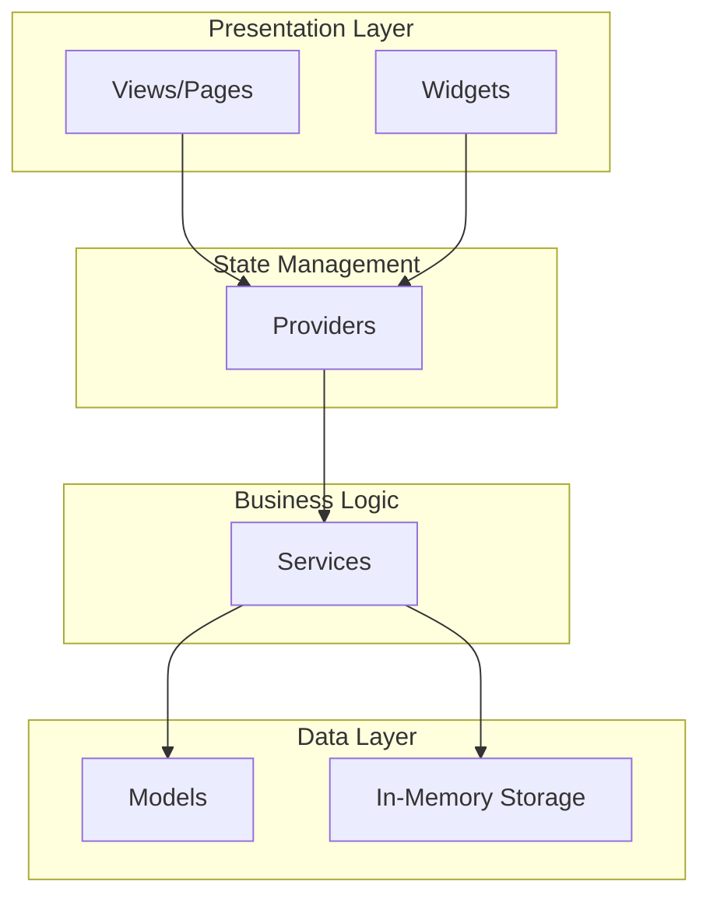
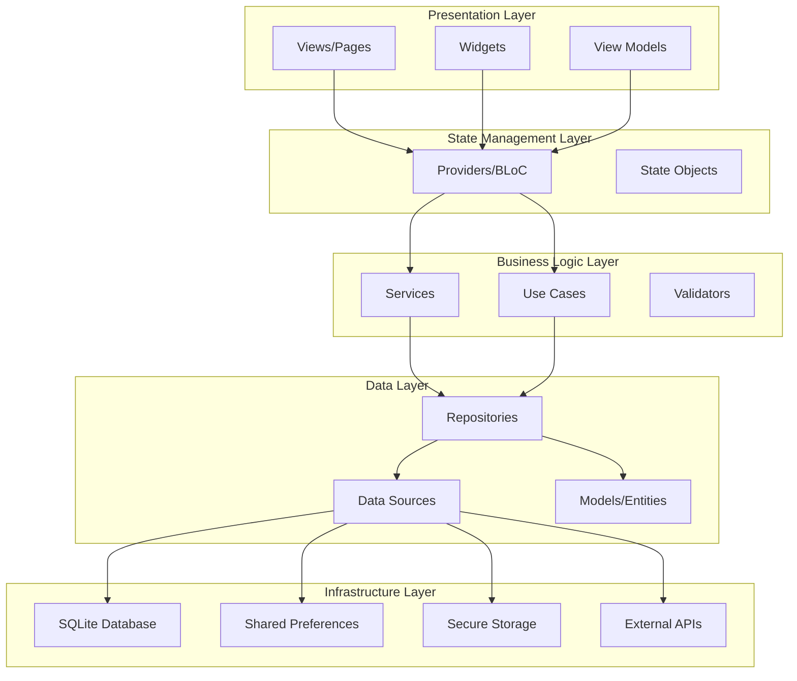
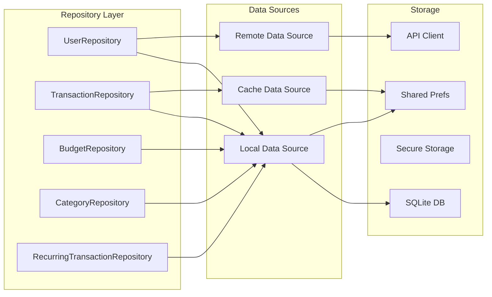
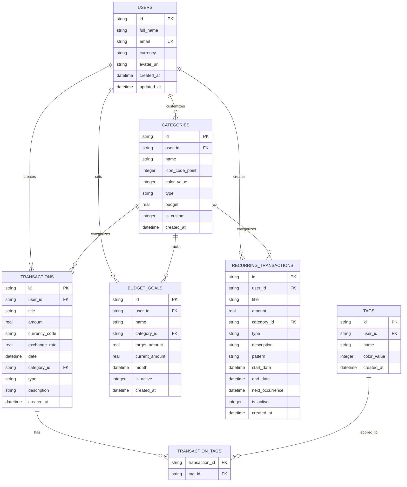
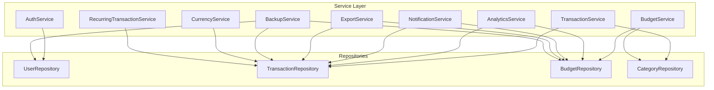
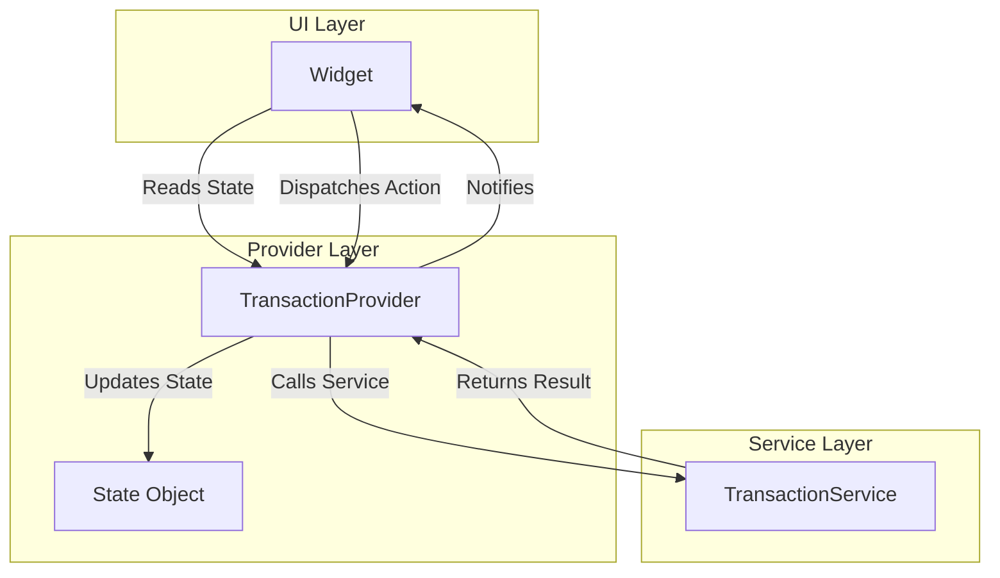

# Technical Architecture Documentation

## Overview

This document provides detailed technical architecture for the enhanced gestion_budgetaire Flutter application, including system design, data flow, component interactions, and architectural patterns.

---

## Current Architecture

### Layer Structure



### Current Limitations
- No data persistence
- Direct service-to-storage coupling
- Limited separation of concerns
- No repository pattern
- Mock authentication only

---

## Proposed Architecture

### Enhanced Layer Structure



---

## Detailed Component Architecture

### 1. Data Layer Architecture



#### Repository Pattern Implementation

**Base Repository Interface**
```dart
abstract class Repository<T> {
  Future<T?> getById(String id);
  Future<List<T>> getAll();
  Future<T> create(T entity);
  Future<T> update(T entity);
  Future<void> delete(String id);
}
```

**Transaction Repository Example**
```dart
class TransactionRepository implements Repository<Transaction> {
  final LocalDataSource _localDataSource;
  final CacheDataSource _cacheDataSource;
  
  TransactionRepository(this._localDataSource, this._cacheDataSource);
  
  @override
  Future<Transaction?> getById(String id) async {
    // Check cache first
    final cached = await _cacheDataSource.getTransaction(id);
    if (cached != null) return cached;
    
    // Fetch from database
    final transaction = await _localDataSource.getTransaction(id);
    
    // Update cache
    if (transaction != null) {
      await _cacheDataSource.cacheTransaction(transaction);
    }
    
    return transaction;
  }
  
  // Additional methods...
  Future<List<Transaction>> getByDateRange(DateTime start, DateTime end);
  Future<List<Transaction>> getByCategory(String categoryId);
  Future<Map<String, double>> getExpensesByCategory();
}
```

---

### 2. Database Architecture

#### Schema Design



#### Database Helper Implementation

```dart
class DatabaseHelper {
  static final DatabaseHelper instance = DatabaseHelper._init();
  static Database? _database;
  
  DatabaseHelper._init();
  
  Future<Database> get database async {
    if (_database != null) return _database!;
    _database = await _initDB('budget_app.db');
    return _database!;
  }
  
  Future<Database> _initDB(String filePath) async {
    final dbPath = await getDatabasesPath();
    final path = join(dbPath, filePath);
    
    return await openDatabase(
      path,
      version: 1,
      onCreate: _createDB,
      onUpgrade: _upgradeDB,
    );
  }
  
  Future<void> _createDB(Database db, int version) async {
    // Create tables
    await db.execute('''
      CREATE TABLE users (
        id TEXT PRIMARY KEY,
        full_name TEXT NOT NULL,
        email TEXT UNIQUE NOT NULL,
        currency TEXT DEFAULT 'TND',
        avatar_url TEXT,
        created_at TEXT NOT NULL,
        updated_at TEXT NOT NULL
      )
    ''');
    
    await db.execute('''
      CREATE TABLE transactions (
        id TEXT PRIMARY KEY,
        user_id TEXT NOT NULL,
        title TEXT NOT NULL,
        amount REAL NOT NULL,
        currency_code TEXT DEFAULT 'TND',
        exchange_rate REAL DEFAULT 1.0,
        date TEXT NOT NULL,
        category_id TEXT NOT NULL,
        type TEXT NOT NULL,
        description TEXT,
        created_at TEXT NOT NULL,
        FOREIGN KEY (user_id) REFERENCES users (id) ON DELETE CASCADE
      )
    ''');
    
    // Create indexes
    await db.execute('CREATE INDEX idx_transactions_user_id ON transactions(user_id)');
    await db.execute('CREATE INDEX idx_transactions_date ON transactions(date)');
    await db.execute('CREATE INDEX idx_transactions_category_id ON transactions(category_id)');
    
    // Additional tables...
  }
  
  Future<void> _upgradeDB(Database db, int oldVersion, int newVersion) async {
    // Handle migrations
    if (oldVersion < 2) {
      // Migration to version 2
    }
  }
}
```

---

### 3. Service Layer Architecture



#### Service Implementation Pattern

```dart
class TransactionService {
  final TransactionRepository _transactionRepository;
  final CategoryRepository _categoryRepository;
  final NotificationService _notificationService;
  
  TransactionService(
    this._transactionRepository,
    this._categoryRepository,
    this._notificationService,
  );
  
  Future<Transaction> addTransaction({
    required String title,
    required double amount,
    required DateTime date,
    required String categoryId,
    required CategoryType type,
    String? description,
  }) async {
    // Validate
    if (amount <= 0) throw ValidationException('Amount must be positive');
    
    // Create transaction
    final transaction = Transaction(
      id: const Uuid().v4(),
      title: title,
      amount: amount,
      date: date,
      categoryId: categoryId,
      type: type,
      description: description,
    );
    
    // Save to repository
    final saved = await _transactionRepository.create(transaction);
    
    // Check budget alerts
    await _checkBudgetAlerts(categoryId);
    
    return saved;
  }
  
  Future<void> _checkBudgetAlerts(String categoryId) async {
    // Logic to check if budget exceeded and send notification
  }
  
  // Additional methods...
}
```

---

### 4. State Management Architecture



#### Provider Implementation

```dart
class TransactionProvider extends ChangeNotifier {
  final TransactionService _transactionService;
  
  List<Transaction> _transactions = [];
  bool _isLoading = false;
  String? _error;
  
  TransactionProvider(this._transactionService);
  
  List<Transaction> get transactions => List.unmodifiable(_transactions);
  bool get isLoading => _isLoading;
  String? get error => _error;
  
  Future<void> loadTransactions() async {
    _isLoading = true;
    _error = null;
    notifyListeners();
    
    try {
      _transactions = await _transactionService.getAllTransactions();
      _isLoading = false;
      notifyListeners();
    } catch (e) {
      _error = e.toString();
      _isLoading = false;
      notifyListeners();
    }
  }
  
  Future<void> addTra